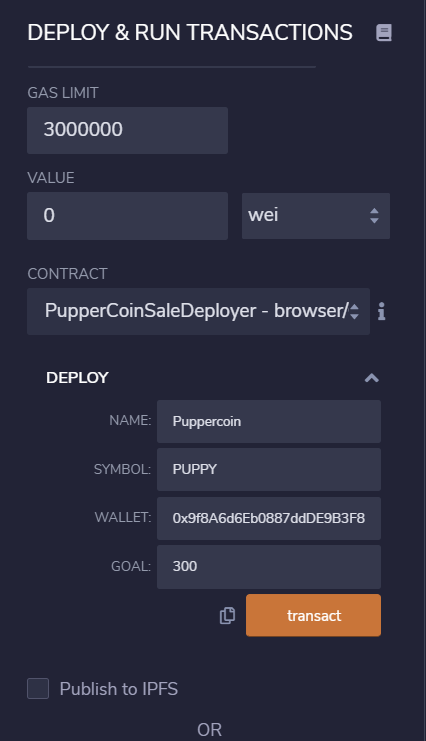
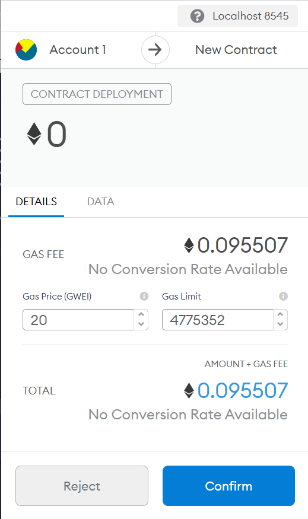
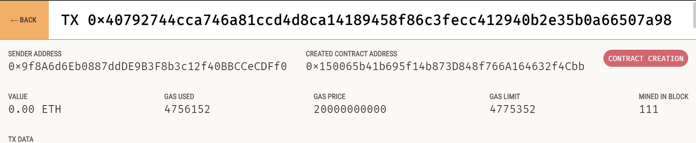
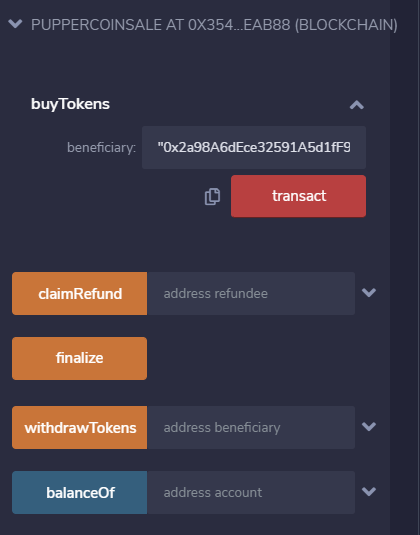
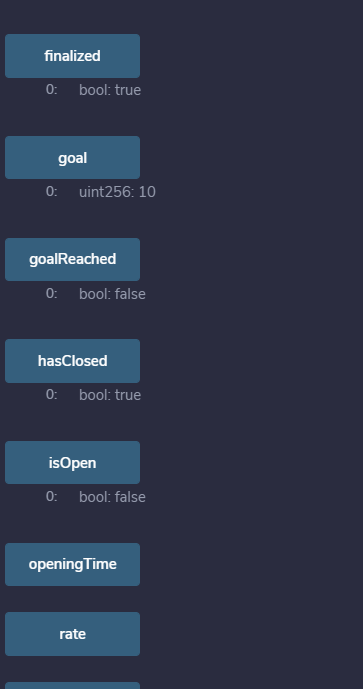

The company has decided to crowdsale their PupperCoin token in order to help fund the network development.

This network will be used to track the dog breeding activity across the globe in a decentralized way, and allow humans to track the genetic trail of their pets. It is required to enable refunds if the crowdsale is successful and the goal is met, and only allowed to raise a maximum of 300 Ether. The crowdsale will run for 24 weeks.

For the project, couple of contracts were developed:

1. Puppercoin contract:

Using standard ERC20Mintable and ERC20Detailed contract, hardcoding 18 as the decimals parameter, and leaving the initial_supply parameter a contract to initialize the puppercoin was created. Available in puppercoin.sol

2. Puppercoin sale contract was constructed by inheriting the following OpenZeppelin contracts:

Crowdsale

MintedCrowdsale

CappedCrowdsale

TimedCrowdsale

RefundablePostDeliveryCrowdsale

3. Puppercoin crowdsale deployer contract was constructed to generate token address and token sale address. this is the addresses where the functions run and the tokens are mined to.

These can be seen in the crowdsale.sol

Procedure:

Once the contracts are designed and coded, the deployer contract is compiled and deployed.

It can be seen on metamask to calculate the expense of the contract

The transaction status tells if the deployment was successful or not

After successful deployment of the deployer contract, the token address and token sale address can be generated. By using the token sale address and the at address feature in Remix, the contract at the address can be called and executed. By which the functions in the Crowdsale, MintedCrowdsale,CappedCrowdsale, TimedCrowdsale, RefundablePostDeliveryCrowdsale can be called and run accordingly.

Step 1: Buy tokens from a beneficiary. Keep in mind the decimals that are selected. Use a different address than the contract address.

Step 2: Once enough tokens are bought till the goal of the contract is reached, the status of the variables isopen, hasclosed, goalreached, capreached can be seen changed.

Step 3: After the statuses are changed, call the finalize function to run the minting of tokens.